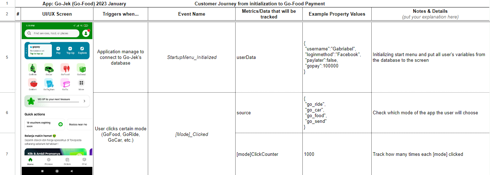

# Data Analytics Portfolio by Gabriabel Yudhistiro

## About Me

An aspiring data analytics professional with solid programming background from 3+ years of experience in providing XR solutions at a SEA-driven tech company. Comfortable with working as a team, translating business problems, gathering requirements into actionable items, and delivering targeted results. Highly determined to improve my technical skills as a data analyst.

Feel free to [connect with me through Linkedin](https://www.linkedin.com/in/gabriabel/)

## Table of Contents:

1. [Go-Food Customer Journey Breakdown](https://github.com/Gabriabel/DA-Portfolio#gofood-customer-journey-breakdown)
2. [Spreadsheet - Retail Property Analysis with Regression Analysis](https://github.com/Gabriabel/DA-Portfolio#spreadsheet---retail-property-analysis-with-regression-analysis)
3. [SQL - Optimizing Clothing Categories Using BCG Matrix](https://github.com/Gabriabel/DA-Portfolio#sql---optimizing-clothing-categories-using-bcg-matrix)
4. [Python - Identifying Key Trends and Customer Segmentation](https://github.com/Gabriabel/DA-Portfolio#python---identifying-key-trends-and-customer-segmentation)
5. [Data Visualization - Brazilian E-commerce Dashboard](https://github.com/Gabriabel/DA-Portfolio#data-visualization---brazilian-e-commerce-dashboard)
6. [Project Based Analytics - Retail Bank Reviews and Credit Cards](https://github.com/Gabriabel/DA-Portfolio#project-based-analytics---retail-bank-reviews-and-credit-cards)

## GoFood Customer Journey Breakdown

This is a mini project where I did a customer journey, in order to deeply understand GoFood's system from both the DA perspective and the Backend perspective. A complete understanding of the application itself will ease the process of gathering insights while maintaining proper workflow with other divisions. Thus, ensuring high precision for the entire analysis process.

Here's [the link for the spreadsheet.](https://docs.google.com/spreadsheets/d/1LclnqPpKFmpFmSvmfoX2MFkEW2NGK3rYKhx60g_NDPc/edit?usp=share_link)

## Spreadsheet - Retail Property Analysis with Regression Analysis

This is another mini project where I did an analysis to understand the business problem that this Retail Company has. Followed by doing a regression analysis to determine the price of each variable in order to achieve one of the purposes of the analysis, which is deciding the price of the retails for potential clients.

Here's [the link to the spreadsheet](https://docs.google.com/spreadsheets/d/1GbnR82EpxnwqSag4uUbG9ROG2cP62hjHm8QKKiRPFoI/edit?usp=share_link) that shows how the flow of the analysis process.

## SQL - Optimizing Clothing Categories Using BCG Matrix

Within this project, I used mainly SQL to do the analysis with the purpose of determining which brands/categories that need to be prioritized/de-prioritized to maximize the profit of the company. In order to achieve that, I did queries to find out the market share of each brand/category. And finally placed them in their own respective standardized BCG matrix.

Here are [the link for the PDF file](https://drive.google.com/file/d/1c5IEH0q8XuHeBWFAV3MGi-qzh9sipx1O/view?usp=share_link) and [the Google BigQuery link](https://console.cloud.google.com/bigquery?sq=112590217515:b174fbece7704c84a03662bf9b21886c)

## Python - Identifying Key Trends and Customer Segmentation

This is a project that I did with Google Colaboratory as its IDE to identify key trends and customer segmentation in a mutual fund startup. By doing the analysis in those directions, I'm able to create insights for other divisions to use in order to create an appropriate thematic campaign.

Here are [the link for the PDF file](https://drive.google.com/file/d/1FSP8XV8KRwmx66kgUTKaGfNB-icZ1VaC/view?usp=share_link) and [the Google Colaboratory file](https://colab.research.google.com/drive/1wYxR124VUB8f10wgSsBbZhj7SXbIW4mG?usp=share_link)

## Data Visualization - Brazilian E-commerce Dashboard

In this mini project, I did data visualization using Google Data Studio based on the objectives that the executives' level needs. The purposes and instructions for the dashboard are also detailed in the deck with the purpose of creating a simple but effective dashboard that's easy to use by the user. As a bonus, there are quick multiple insights that can be analyzed from the created dashboard.

Here's [the link for the PDF file.](https://drive.google.com/file/d/1fLcg_hNtdvvwchN554Zv_V5fudYHr2v1/view?usp=share_link)

## Project Based Analytics - Retail Bank Reviews and Credit Cards

This is a team project where I acted as the project manager. The purpose of this project is to find solutions to increase the overall rating of the bank itself and increase the number of credit cards user.

Here's [the link for the PDF file.](https://drive.google.com/file/d/1Jt_ObCiJO5zpPruY6yFwNQ6L3GKoG8vy/view?usp=share_link)
